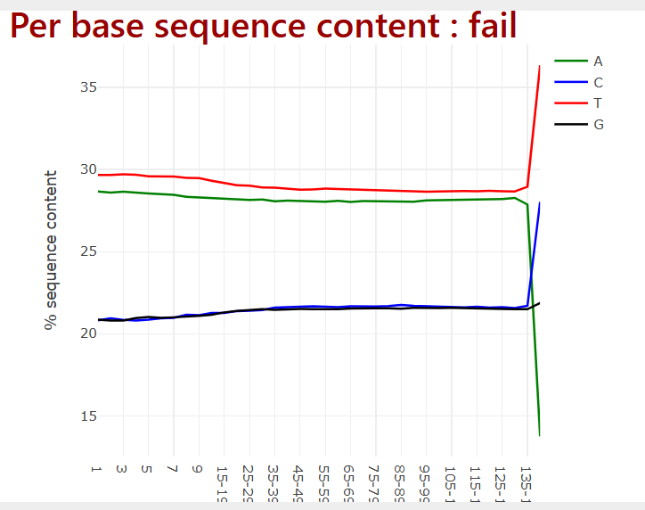
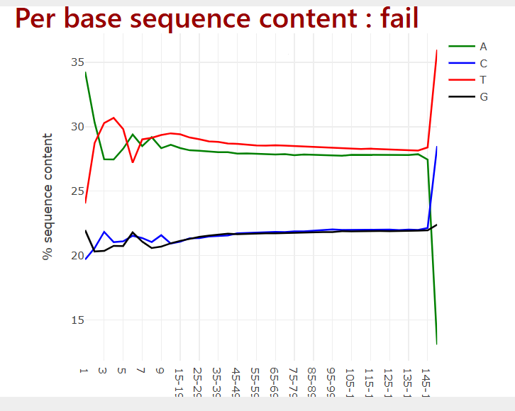
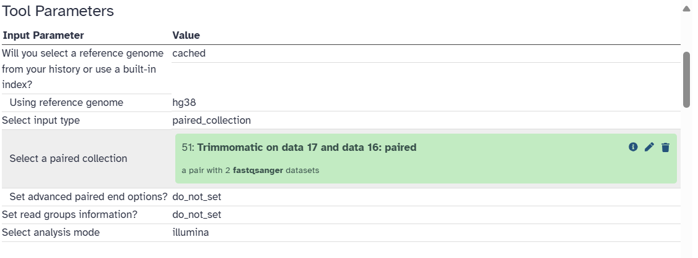
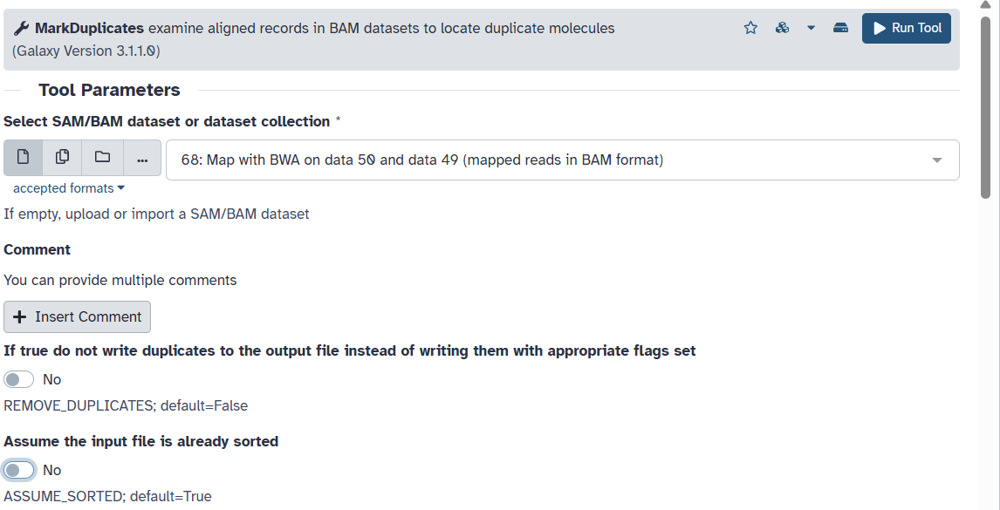
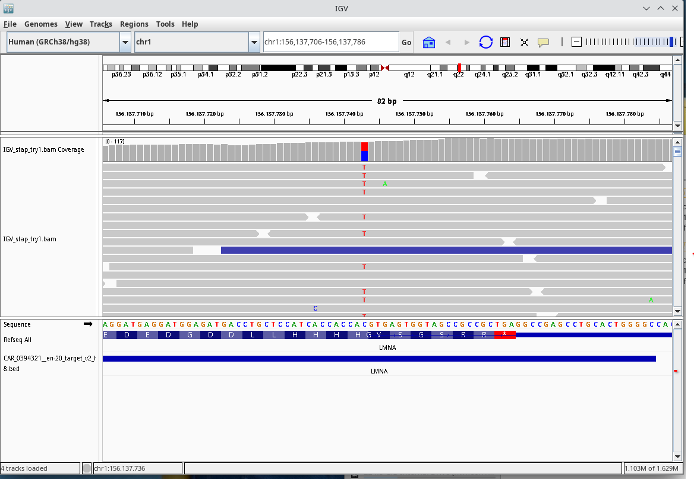
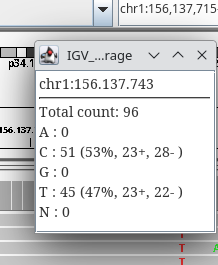

```{r}
# used libraries

```

## Introductie

Voor periode 1 hebben we een casus opdracht gekregen en gaan wij (Nicole en ik) een opdracht maken. De opdracht gaat over het leren van NGS en hoe we dit het beste kunnen analyseren met data van een patient.

### -wat is er al bekent?

Over de patient nog niet veel aangezien ik de data nog niet echt heb doorgelezen.

### -Ideeen over onderzoekopszet

\_We hebben inprenciepe een stappenplan ontvangen waar nog een aantal stappen uit ontbreken, vanuit hier word er dus simpel weg gewerkt aan de "onbrekende" stappen. <https://rwedema.github.io/NGS-Genetics/intro.html>\_

### -Is er al data?

Er is al data

## 9-9-2025

We hebben de patient en data ontvangen en hierbij ging ik meteen het in galaxy oploaden, verder heb ik nog niet echt wat met de data gedaan.

## 12-9-2025

### Quality control

Om te controleren of de data uberhaupt goed is van kwaliteit heb ik het bestandje in galaxy gerunned op Falco. Inplaats van FASTqc, Falco geeft dezelfde grafieken terug als FASTqc. De reden dat ik Falco gebruik is omdat dat werd aangeraden door galaxy zelf.

De eerste fail die ik kreeg was bij de per base sequence content, dit houdt in dat het verschil bij A en T of G en C verhouding groter is dan 20%. Dit heb ik van de documentatie van FASTqc gehaald (<https://www.bioinformatics.babraham.ac.uk/projects/fastqc/Help/3%20Analysis%20Modules/4%20Per%20Base%20Sequence%20Content.html>).

Daarna kreeg ik een warning bij de GC sequence content, deze warning verschijnt als er de afwijking meer dan 15% is vergeleken de "normale" verdeling. Hieronder een afbeelding van de grafiek: 

## 15-9-2025

In het weekend wou ik dit eigenlijk al afmaken maar ik had geen wifi, dus ik ga vandaag verder met het quality control stukje.

Ik maak me eigenlijk niet zo zorgen ome het GC sequence content, dat ziet er opzich wel prima uit. De theoretische data komt van een "random library", dit hoeft dus niets te zeggen waarom het een "warning"geeft.

De rest van de warnings zien er eigenlijk ook prima uit dus ik ga nu eerst proberen om de data iets in te korten dit ga ik doen met cutadapt, hierbij gebruik ik een workflow. Eerst upload ik de data \> daarna gebruik ik cutadapt\> en weer Falco. Hieronder is mijn eerste "test" te zien in een afbeelding.

Dit werkte niet en kreeg een HTML error dus ik denk dat ik iets fout heb gedaan. Ik ga nu proberen om FASTQC te runnen en kijken of ik nog steeds hetzelfde probleem ontvant.

Ik was weer te snel bezig en het bleek dat ik de hele verkeerde tool gebruikte... OOps Oke nu ga ik Trimmanotics gebruiken. Trimmanotics geeft 4 files, hier ga ik allemaal falco op gebruiken.

## 17-9-2025

Ik kwam erachter dat ik galaxy anders kon gebruiken en de paired data in een collection kon zetten. Dit heb ik gedaan en weer door falco gehaald. Hier kwam hetzelfde eigenlijk uit dus begon ik met opnieuw trimmen als een pair. Hierbij ging ik de eerste 10 basen eraf halen.

Ik had het de eerste keer fout gedaan, ik had bij de instellingen ingesteld dat als het minder dan 9 sequenties was dat het dan verwijderd word. Dit is natuurlijk super weinig en komt eigenlijk niet voor dus de data bleek hetzelfde. Hierna heb ik ronald gevraagd hoe het moest en heb ik het wel goed gedaan. Hier kwam na het door falco runnen wel een beter resultaat uit: zie afbeelding:

Dit is echt veel beter dan het vorige resultaat maar nog steed seen fail zie afbeelding hieronder voor voor het trimmen:

## 19-9-2025

Vandaag ga ik verder met week 2 van de uitleg en instructies. Hierbij ga ik de tool map with BWA gebruiken, dit duurt ongeveer 20 min. Dit gaf een error omdat ik blijkbaar het verkeerde referentiegenoom heb gebruikt, ik dacht dat het slim was om met een bij te vergelijken (ik had het niet gezien). Gelukkig kwam ik erachter dat ik een HUMAAN genoom moest gebruiken als referentie dus hierna volgde poging 2....

De settings zet ik als een screenshot hieronder: 

## 22-9-2025

Na dat de galaxy server weer down was is het met de juiste settings gelukt. De volgende stap is kijken naar duplicaties van de mapped reads. Dit ga ik doen met de tool MarkDuplicates. Als input voeg ik de map met BWA-MEM output toe, hierbij als setting: "assume input file is already sorted" op nee. Dit zorgt ervoor dat de tool niet gaat vooordelen dat de data al is gesorteerd. De tool markeerd eigenlijk de duplicates, omdat het gemarkeerd is negeren de andere tools deze "flag" de data word ook niet verwijderd. Hieronder een screenshot van de settings van de MarkDuplicates tool:

Deze stap is gelukt dus nu kijken naar de data dit doe ik als volgt. Dit ga ik doen met de mapping output van de stap hiervoor (marked duplicates). Als eerst ging ik de data downloaden naar mijn laptop zelf.

Na het downloaden van de bestanden heb ik deze geupload in de IGV tool, dit is een visualisatie tool. Hierin kan je de data wat je gemapped hebt een beetje visualizeren. Ik heb als referentie genoom precies hetzelfde genoom gebruikt als wat ik bij galaxy gebruikt heb (hg38). Het eerste wat mij opviel was een mutatie van LMNA, dit is een genetische afwijking die kan zorgen voor cardiomyopathie.

Deze mutatie heb ik gevonden omdat ik tijdens het bekijken van de data een lijn zag, als je hier inzoomed zie je ook meteen dat er allemaal T'jes niet op de juiste plek zaten. Hieronder een screen van de visualisatie en waar ik naar keek:

De grijze gebieden zijn hetzelfde als het referentie gebied, de percentages zijn bijna 50/50 dit wil zeggen dat het heterozygoot is. Als het homozygoot zou zijn zou je het minder goed verdeeld hebben.(<https://erdemhospital.com/nl/blog/what-are-homozygous-and-heterozygous-traits/>) Zie afbeelding hieronder: 
