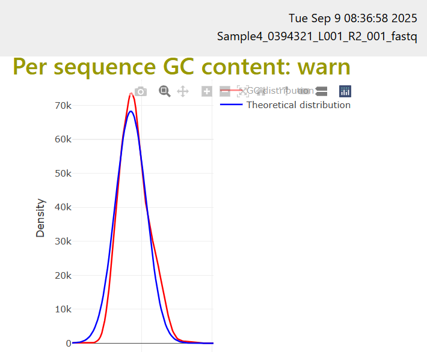
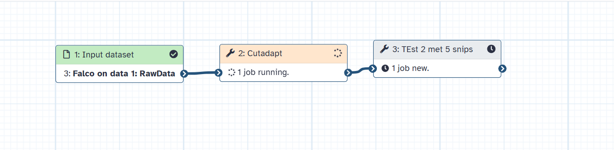

```{r}
# used libraries

```

## Introductie

Voor periode 1 hebben we een casus opdracht gekregen en gaan wij (Nicole en ik) een opdracht maken. De opdracht gaat over het leren van NGS en hoe we dit het beste kunnen analyseren met data van een patient.

### -wat is er al bekent?

Over de patient nog niet veel aangezien ik de data nog niet echt heb doorgelezen.

### -Ideeen over onderzoekopszet

\_We hebben inprenciepe een stappenplan ontvangen waar nog een aantal stappen uit ontbreken, vanuit hier word er dus simpel weg gewerkt aan de "onbrekende" stappen. <https://rwedema.github.io/NGS-Genetics/intro.html>\_

### -Is er al data?

Er is al data

## 9-9-2025

We hebben de patient en data ontvangen en hierbij ging ik meteen het in galaxy oploaden, verder heb ik nog niet echt wat met de data gedaan.

## 12-9-2025

### Quality control

Om te controleren of de data uberhaupt goed is van kwaliteit heb ik het bestandje in galaxy gerunned op Falco. Inplaats van FASTqc, Falco geeft dezelfde grafieken terug als FASTqc. De reden dat ik Falco gebruik is omdat dat werd aangeraden door galaxy zelf.

De eerste fail die ik kreeg was bij de per base sequence content, dit houdt in dat het verschil bij A en T of G en C verhouding groter is dan 20%. Dit heb ik van de documentatie van FASTqc gehaald (<https://www.bioinformatics.babraham.ac.uk/projects/fastqc/Help/3%20Analysis%20Modules/4%20Per%20Base%20Sequence%20Content.html>).

Daarna kreeg ik een warning bij de GC sequence content, deze warning verschijnt als er de afwijking meer dan 15% is vergeleken de "normale" verdeling. Hieronder een afbeelding van de grafiek: 

## 15-9-2025

In het weekend wou ik dit eigenlijk al afmaken maar ik had geen wifi, dus ik ga vandaag verder met het quality control stukje.

Ik maak me eigenlijk niet zo zorgen ome het GC sequence content, dat ziet er opzich wel prima uit. De theoretische data komt van een "random library", dit hoeft dus niets te zeggen waarom het een "warning"geeft.

De rest van de warnings zien er eigenlijk ook prima uit dus ik ga nu eerst proberen om de data iets in te korten dit ga ik doen met cutadapt, hierbij gebruik ik een workflow. Eerst upload ik de data \> daarna gebruik ik cutadapt\> en weer Falco. Hieronder is mijn eerste "test" te zien in een afbeelding.

Dit werkte niet en kreeg een HTML error dus ik denk dat ik iets fout heb gedaan. Ik ga nu proberen om FASTQC te runnen en kijken of ik nog steeds hetzelfde probleem ontvant. 

Ik was weer te snel bezig en het bleek dat ik de hele verkeerde tool gebruikte... OOps Oke nu ga ik Trimmanotics gebruiken. Trimmanotics geeft 4 files, hier ga ik allemaal falco op gebruiken. 
